### 1. 说明

Sentinel的实时监控数据， 默认是放在内存里面， 采用ConcurrentHashMap结构，只保留5分钟时间内的数据，不能满足实际生产中的监控需要， 这里我们进行二次开发改造。

改造使用的版本：

> 1. Sentinel为1.8.X版本
> 2. InfluxDB为2.X系列版本


### 2. Sentinel源码改造

下载Sentinel的源码， 修改sentinel-dashboard模块

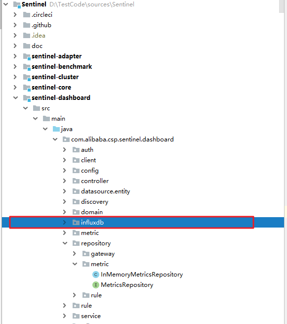

创建包com.alibaba.csp.sentinel.dashboard.influxdb， 将修改的源码放在此包下：

1. 创建InfluxDB的映射实体

   ```java
   @Data
   @Measurement(name = "sentinelInfo")
   public class InfluxDBMetricEntity {
   
       @Column(name = "time")
       private Instant time;
       @Column(name = "gmtCreate", tag = true)
       private long gmtCreate;
       @Column(name = "gmtModified")
       private long gmtModified;
   
       /**
        * 监控信息的时间戳
        */
       @Column(name = "app", tag = true)
       private String app;
       @Column(name = "resource", tag = true)
       private String resource;
       @Column(name = "timestamp", tag = true)
       private long timestamp;
       @Column(name = "passQps", tag = true)
       private long passQps;//通过qps
       @Column(name = "successQps", tag = true)
       private long successQps;//成功qps
       @Column(name = "blockQps", tag = true)
       private long blockQps;//限流qps
       @Column(name = "_exceptionQps")
       private long exceptionQps;//异常qps
   
       /**
        * 所有successQps的rt的和
        */
       @Column(name = "rt", tag = true)
       private double rt;
   
       /**
        * 本次聚合的总条数
        */
       @Column(name = "count", tag = true)
       private int count;
       @Column(name = "resourceCode", tag = true)
       private int resourceCode;
   
   }
   
   ```

   如果要将字段查询出来， 将tag属性设置为true。


2. InfluxDB的配置类

   ```java
   @Configuration
   @Data
   public class InfluxDBConfig {
   
       /**
        * influxdb连接URL
        */
       @Value("${spring.influx.url:''}")
       private String influxUrl;
   
       /**
        * influxdb的访问token权限
        */
       @Value("${spring.influx.token:''}")
       private String influxToken;
   
       /**
        * org组织名称
        */
       @Value("${spring.influx.org:''}")
       private String influxOrg;
   
       /**
        * bucket名称
        */
       @Value("${spring.influx.bucket:''}")
       private String influxBucket;
   
   
       /**
        * 初始化influx client
        * @return
        */
       @Bean
       public InfluxDBClient influxDBClient() {
           InfluxDBClient influxDBClient = InfluxDBClientFactory.create(influxUrl, influxToken.toCharArray(), influxOrg, influxBucket);
           return influxDBClient;
       }
   
       /**
        * 创建Write Api （负责写入）
        * @param influxDBClient
        * @return
        */
       @Bean
       public WriteApiBlocking writeApiBlocking (InfluxDBClient influxDBClient) {
           WriteApiBlocking writeApiBlocking = influxDBClient.getWriteApiBlocking();
           return writeApiBlocking;
       }
   
       /**
        * 创建Query Api （负责查询）
        * @param influxDBClient
        * @return
        */
       @Bean
       public QueryApi queryApi(InfluxDBClient influxDBClient) {
           QueryApi queryApi = influxDBClient.getQueryApi();
           return queryApi;
       }
   
   }
   ```

   InfluxDB2.X与influxDB1.X的配置不一样， 不需要配置用户名和密码， 用TOKEN替代， 要增加org与bucket的配置。

   将InfluxDBClient注入Spring容器， 同时分别注入写入与查询的API操作接口。

   

3. TOEKN的申请配置

   进入后台，创建TOKEN

   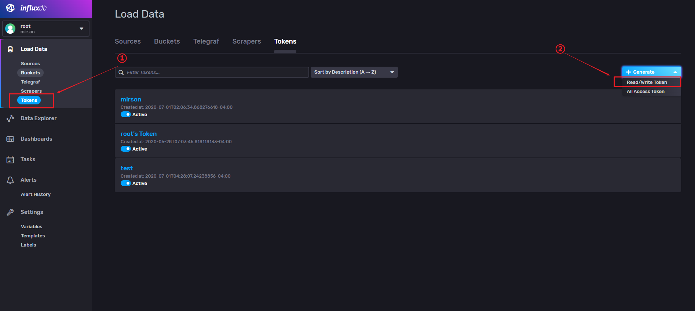

   再弹出界面， 选择对应的bucket容器

   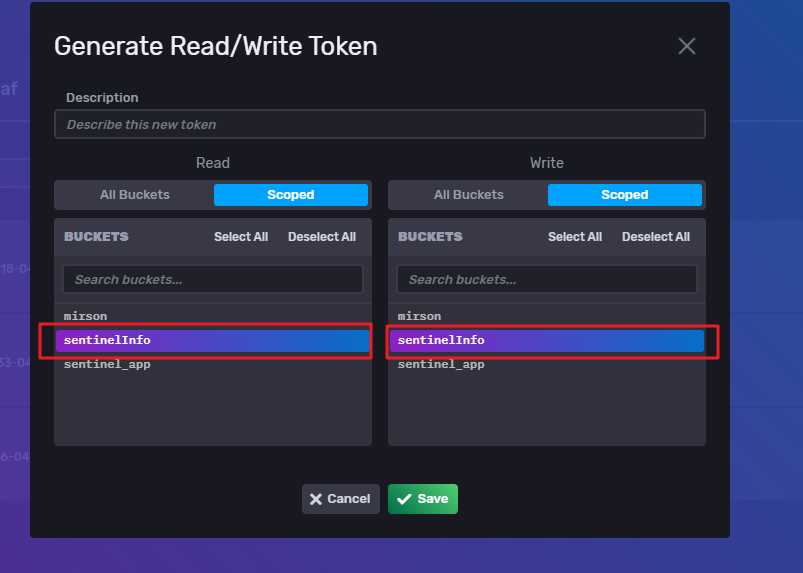

   保存后， 会生成一个TOKEN， 点击复制

   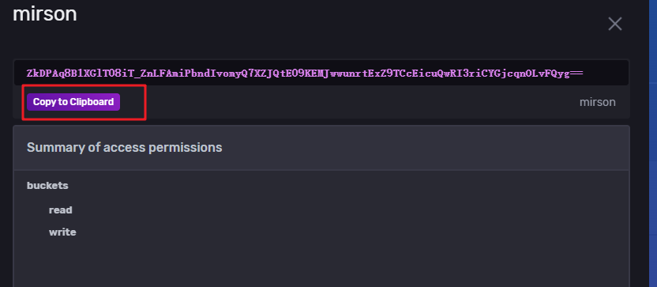


4. 工程配置

   ```properties
   # influxdb连接地址
   spring.influx.url=http://10.10.20.32:8086
   # influxdb的访问token
   spring.influx.token=ZkDPAq8B1XGlT08iT_ZnLFAmiPbndIvomyQ7XZJQtE09KEMJwwunrtExZ9TCcEicuQwRI3riCYGjcqnOLvFQyg==
   # org组织名称
   spring.influx.org=mirson
   # bucket名称
   spring.influx.bucket=sentinel_app
   ```

   

5. InfluxDB的持久化实现

   InfluxDBMetricsRepository完整代码：

   ```java
   package com.alibaba.csp.sentinel.dashboard.influxdb;
   
   import com.alibaba.csp.sentinel.dashboard.datasource.entity.MetricEntity;
   import com.alibaba.csp.sentinel.dashboard.influxdb.config.InfluxDBConfig;
   import com.alibaba.csp.sentinel.dashboard.influxdb.entity.InfluxDBMetricEntity;
   import com.alibaba.csp.sentinel.dashboard.repository.metric.MetricsRepository;
   import com.alibaba.csp.sentinel.util.StringUtil;
   import com.influxdb.client.InfluxDBClient;
   import com.influxdb.client.QueryApi;
   import com.influxdb.client.WriteApiBlocking;
   import com.influxdb.client.domain.WritePrecision;
   import com.influxdb.query.FluxRecord;
   import com.influxdb.query.FluxTable;
   import org.springframework.beans.BeanUtils;
   import org.springframework.beans.factory.annotation.Autowired;
   import org.springframework.stereotype.Component;
   import org.springframework.util.CollectionUtils;
   
   import java.time.Instant;
   import java.util.ArrayList;
   import java.util.HashMap;
   import java.util.List;
   import java.util.Map;
   import java.util.stream.Collectors;
   
   @Component("influxDBMetricsRepository")
   public class InfluxDBMetricsRepository implements MetricsRepository<MetricEntity> {
   
       @Autowired
       private InfluxDBConfig influxDBConfig;
   
       @Autowired
       public WriteApiBlocking writeApiBlocking;
   
       @Autowired
       public InfluxDBClient influxDBClient;
   
       @Autowired
       public QueryApi queryApi;
   
   
       /**
        * 保存数据
        * @param metric metric data to save
        */
       @Override
       public synchronized void save(MetricEntity metric) {
   
           try {
               // 记录数据
               InfluxDBMetricEntity entity = new InfluxDBMetricEntity();
               BeanUtils.copyProperties(metric, entity, new String[]{"gmtCreate", "gmtModified", "timestamp"});
               entity.setResource(metric.getResource());
               entity.setGmtCreate(metric.getGmtCreate().getTime());
               entity.setGmtModified(metric.getGmtModified().getTime());
               entity.setTimestamp(metric.getTimestamp().getTime());
               entity.setPassQps(metric.getPassQps());
               entity.setSuccessQps(metric.getSuccessQps());
               entity.setBlockQps(metric.getBlockQps());
               entity.setExceptionQps(metric.getExceptionQps());
               entity.setRt(metric.getRt());
               entity.setCount(metric.getCount());
               entity.setResourceCode(metric.getResourceCode());
               entity.setTime(Instant.now());
               writeApiBlocking.writeMeasurement(WritePrecision.MS, entity);
   
           } catch (Exception e) {
   
               e.printStackTrace();
           }
       }
   
       /**
        * 批量保存
        * @param metrics metrics to save
        */
       @Override
       public synchronized void saveAll(Iterable<MetricEntity> metrics) {
   
           if (metrics == null) {
               return;
           }
           metrics.forEach(metric -> {
   
               save(metric);
   
           });
       }
   
       /**
        * 根据时间范围查询数据
        * @param app       application name for Sentinel
        * @param resource  resource name
        * @param startTime start timestamp
        * @param endTime   end timestamp
        * @return
        */
       @Override
       public synchronized List<MetricEntity> queryByAppAndResourceBetween(String app, String resource, long startTime, long endTime) {
   
           List<MetricEntity> results = new ArrayList<>();
           if (StringUtil.isBlank(app)) {
   
               return results;
           }
   
           // 根据APP和RESOURCE查询时间范围内的数据
           String flux = String.format("from(bucket:\"%s\") |> range(start: %s, stop: %s)"
                           + " |> filter(fn: (r) => (r[\"_measurement\"] == \"sentinelInfo\" and r[\"app\"] == \"%s\") and r[\"resource\"] == \"%s\")",
                   influxDBConfig.getInfluxBucket(), startTime, endTime, app, resource);
   
           List<FluxTable> tables = queryApi.query(flux);
           for (FluxTable fluxTable : tables) {
               List<FluxRecord> records = fluxTable.getRecords();
               for (FluxRecord fluxRecord : records) {
                   MetricEntity metricEntity = MetricEntity.copyOf(fluxRecord);
                   results.add(metricEntity);
               }
           }
   
           return results;
       }
   
   
       @Override
       public synchronized List<String> listResourcesOfApp(String app) {
   
           List<String> results = new ArrayList<>();
           if (StringUtil.isBlank(app)) {
   
               return results;
           }
           //查询最近5分钟的指标(实时数据)
           String command = String.format("from(bucket:\"%s\") |> range(start: -5m)"
                           + " |> filter(fn: (r) => (r[\"_measurement\"] == \"sentinelInfo\" and r[\"app\"] == \"%s\") )",
                   influxDBConfig.getInfluxBucket(), app);
   
   
           List<MetricEntity> influxResults = new ArrayList<>();
   
           // 查询
           List<FluxTable> tables = queryApi.query(command);
           for (FluxTable fluxTable : tables) {
               List<FluxRecord> records = fluxTable.getRecords();
               for (FluxRecord fluxRecord : records) {
                   MetricEntity metricEntity = MetricEntity.copyOf(fluxRecord);
                   influxResults.add(metricEntity);
               }
           }
   
           try {
   
               if (CollectionUtils.isEmpty(influxResults)) {
                   return results;
               }
               Map<String, MetricEntity> resourceCount = new HashMap<>(32);
               for (MetricEntity metricEntity : influxResults) {
                   String resource = metricEntity.getResource();
                   if (resourceCount.containsKey(resource)) {
                       // 累加统计
                       MetricEntity oldEntity = resourceCount.get(resource);
                       oldEntity.addPassQps(metricEntity.getPassQps());
                       oldEntity.addRtAndSuccessQps(metricEntity.getRt(), metricEntity.getSuccessQps());
                       oldEntity.addBlockQps(metricEntity.getBlockQps());
                       oldEntity.addExceptionQps(metricEntity.getExceptionQps());
                       oldEntity.addCount(1);
                   } else {
   
                       resourceCount.put(resource, metricEntity);
                   }
               }
               //排序
               results = resourceCount.entrySet()
                       .stream()
                       .sorted((o1, o2) -> {
                           MetricEntity e1 = o1.getValue();
                           MetricEntity e2 = o2.getValue();
                           int t = e2.getBlockQps().compareTo(e1.getBlockQps());
                           if (t != 0) {
   
                               return t;
                           }
                           return e2.getPassQps().compareTo(e1.getPassQps());
                       })
                       .map(Map.Entry::getKey)
                       .collect(Collectors.toList());
           } catch (Exception e) {
   
               e.printStackTrace();
           }
           return results;
       }
   }
   
   ```

   

6. 需要改造的其他源码

   influxdb的持久化已经实现， 还需要修改相关调用的源码：

   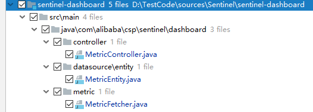

   1） MetricController的改动： 

   将原来的内存存储改为influxdb接口进行存储：

   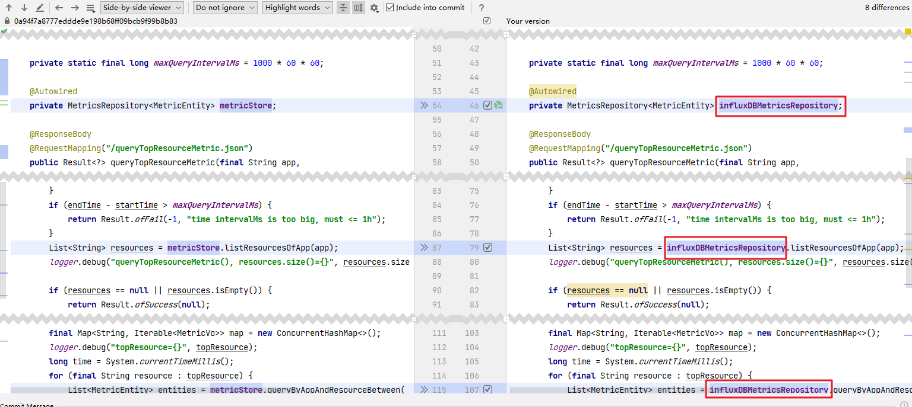

   2） MetricEntity改动后的完整源码：

   主要增加对象之间互相转换的接口（InfluxDBMetricEntity、FluxRecord）：

   ```java
   package com.alibaba.csp.sentinel.dashboard.datasource.entity;
   
   import com.alibaba.csp.sentinel.dashboard.influxdb.entity.InfluxDBMetricEntity;
   import com.influxdb.query.FluxRecord;
   
   import java.util.Date;
   
   /**
    * @author leyou
    */
   public class MetricEntity {
       private Long id;
       private Date gmtCreate;
       private Date gmtModified;
       private String app;
       /**
        * 监控信息的时间戳
        */
       private Date timestamp;
       private String resource;
       private Long passQps;
       private Long successQps;
       private Long blockQps;
       private Long exceptionQps;
   
       /**
        * summary rt of all success exit qps.
        */
       private double rt;
   
       /**
        * 本次聚合的总条数
        */
       private int count;
   
       private int resourceCode;
   
       /**
        * 对象转换（MetricEntity）
        * @param oldEntity
        * @return
        */
       public static MetricEntity copyOf(MetricEntity oldEntity) {
           MetricEntity entity = new MetricEntity();
           entity.setId(oldEntity.getId());
           entity.setGmtCreate(oldEntity.getGmtCreate());
           entity.setGmtModified(oldEntity.getGmtModified());
           entity.setApp(oldEntity.getApp());
           entity.setTimestamp(oldEntity.getTimestamp());
           entity.setResource(oldEntity.getResource());
           entity.setPassQps(oldEntity.getPassQps());
           entity.setBlockQps(oldEntity.getBlockQps());
           entity.setSuccessQps(oldEntity.getSuccessQps());
           entity.setExceptionQps(oldEntity.getExceptionQps());
           entity.setRt(oldEntity.getRt());
           entity.setCount(oldEntity.getCount());
           return entity;
       }
   
       /**
        * 对象转换（FluxRecord）
        * @param fluxRecord
        * @return
        */
       public static MetricEntity copyOf(FluxRecord fluxRecord) {
           MetricEntity entity = new MetricEntity();
           entity.setApp(toStr(fluxRecord.getValueByKey("app")));
           entity.setResource(toStr(fluxRecord.getValueByKey("resource")));
           entity.setBlockQps(toLongZero(fluxRecord.getValueByKey("blockQps")));
           entity.setCount(toInt(fluxRecord.getValueByKey("count")));
           entity.setExceptionQps(toLongZero(fluxRecord.getValueByKey("_exceptionQps")));
           entity.setGmtCreate(toDate(toLong(fluxRecord.getValueByKey("gmtCreate"))));
           entity.setGmtModified(toDate(toLong(fluxRecord.getValueByKey("gmtModified"))));
           entity.setPassQps(toLongZero(fluxRecord.getValueByKey("passQps")));
           entity.setSuccessQps(toLongZero(fluxRecord.getValueByKey("successQps")));
           entity.setRt(toDouble(fluxRecord.getValueByKey("rt")));
           entity.setTimestamp(toDate(toLong(fluxRecord.getValueByKey("timestamp"))));
           return entity;
       }
   
       /**
        * 对象转换（FluxRecord）
        * @param fluxRecord
        * @return
        */
       public static MetricEntity copyOf(InfluxDBMetricEntity fluxRecord) {
           MetricEntity entity = new MetricEntity();
           entity.setGmtCreate(toDate(fluxRecord.getGmtCreate()));
           entity.setGmtModified(toDate(fluxRecord.getGmtModified()));
           entity.setApp(fluxRecord.getApp());
           entity.setTimestamp(toDate(fluxRecord.getTimestamp()));
           entity.setResource(fluxRecord.getResource());
           entity.setPassQps(fluxRecord.getPassQps());
           entity.setBlockQps(fluxRecord.getBlockQps());
           entity.setSuccessQps(fluxRecord.getSuccessQps());
           entity.setExceptionQps(fluxRecord.getExceptionQps());
           entity.setRt(fluxRecord.getRt());
           entity.setCount(fluxRecord.getCount());
           return entity;
       }
   
       /**
        * 转换为时间
        * @param time
        * @return
        */
       private static Date toDate(Long time) {
           if(null != time) {
               return new Date(time);
           }
           return new Date();
       }
   
   
       /**
        * 转换为字符串
        *
        * @param obj
        * @return
        */
       private static String toStr(Object obj) {
           return String.valueOf(obj);
       }
   
       /**
        * 转为换双精度类型
        *
        * @param obj
        * @return
        */
       private static double toDouble(Object obj) {
           if (null != obj) {
               return Double.valueOf(toStr(obj));
           }
           return 0;
       }
   
   
       /**
        * 转换为长整形， 默认为0
        * @param obj
        * @return
        */
       private static Long toLongZero(Object obj) {
           if (null != obj) {
               return Long.valueOf(toStr(obj));
           }
           return 0L;
       }
   
       /**
        * 转换为长整型
        *
        * @param obj
        * @return
        */
       private static Long toLong(Object obj) {
           if (null != obj) {
               return Long.valueOf(toStr(obj));
           }
           return null;
       }
   
       /**
        * 转换为整型
        *
        * @param obj
        * @return
        */
       private static int toInt(Object obj) {
           if (null != obj) {
               return Integer.valueOf(toStr(obj));
           }
           return 0;
       }
   
       public synchronized void addPassQps(Long passQps) {
           this.passQps += passQps;
       }
   
       public synchronized void addBlockQps(Long blockQps) {
           this.blockQps += blockQps;
       }
   
       public synchronized void addExceptionQps(Long exceptionQps) {
           this.exceptionQps += exceptionQps;
       }
   
       public synchronized void addCount(int count) {
           this.count += count;
       }
   
       public synchronized void addRtAndSuccessQps(double avgRt, Long successQps) {
           this.rt += avgRt * successQps;
           this.successQps += successQps;
       }
   
       /**
        * {@link #rt} = {@code avgRt * successQps}
        *
        * @param avgRt      average rt of {@code successQps}
        * @param successQps
        */
       public synchronized void setRtAndSuccessQps(double avgRt, Long successQps) {
           this.rt = avgRt * successQps;
           this.successQps = successQps;
       }
   
       public Long getId() {
           return id;
       }
   
       public void setId(Long id) {
           this.id = id;
       }
   
       public Date getGmtCreate() {
           return gmtCreate;
       }
   
       public void setGmtCreate(Date gmtCreate) {
           this.gmtCreate = gmtCreate;
       }
   
       public Date getGmtModified() {
           return gmtModified;
       }
   
       public void setGmtModified(Date gmtModified) {
           this.gmtModified = gmtModified;
       }
   
       public String getApp() {
           return app;
       }
   
       public void setApp(String app) {
           this.app = app;
       }
   
       public Date getTimestamp() {
           return timestamp;
       }
   
       public void setTimestamp(Date timestamp) {
           this.timestamp = timestamp;
       }
   
       public String getResource() {
           return resource;
       }
   
       public void setResource(String resource) {
           this.resource = resource;
           this.resourceCode = resource.hashCode();
       }
   
       public Long getPassQps() {
           return passQps;
       }
   
       public void setPassQps(Long passQps) {
           this.passQps = passQps;
       }
   
       public Long getBlockQps() {
           return blockQps;
       }
   
       public void setBlockQps(Long blockQps) {
           this.blockQps = blockQps;
       }
   
       public Long getExceptionQps() {
           return exceptionQps;
       }
   
       public void setExceptionQps(Long exceptionQps) {
           this.exceptionQps = exceptionQps;
       }
   
       public double getRt() {
           return rt;
       }
   
       public void setRt(double rt) {
           this.rt = rt;
       }
   
       public int getCount() {
           return count;
       }
   
       public void setCount(int count) {
           this.count = count;
       }
   
       public int getResourceCode() {
           return resourceCode;
       }
   
       public Long getSuccessQps() {
           return successQps;
       }
   
       public void setSuccessQps(Long successQps) {
           this.successQps = successQps;
       }
   
       @Override
       public String toString() {
           return "MetricEntity{" +
                   "id=" + id +
                   ", gmtCreate=" + gmtCreate +
                   ", gmtModified=" + gmtModified +
                   ", app='" + app + '\'' +
                   ", timestamp=" + timestamp +
                   ", resource='" + resource + '\'' +
                   ", passQps=" + passQps +
                   ", blockQps=" + blockQps +
                   ", successQps=" + successQps +
                   ", exceptionQps=" + exceptionQps +
                   ", rt=" + rt +
                   ", count=" + count +
                   ", resourceCode=" + resourceCode +
                   '}';
       }
   
   }
   ```

   3） MetricFetcher的改动：

   将持久化接口改为influxdb进行存储：

   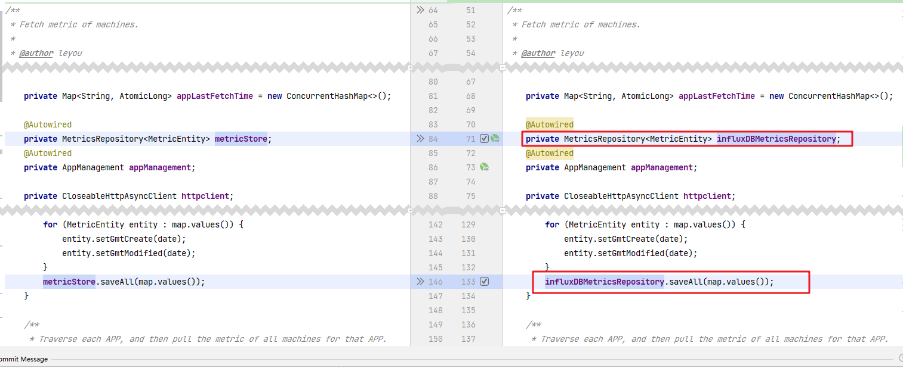


### 3. 集成验证

sentinel-dashboard也是一个spring boot服务， 这里直接将sentinel-dashboard自身接入Sentinel的管理。

1. pom配置

   增加sentinel自动化配置依赖：

   ```xml
   <!-- Sentinel 限流组件 -->
   <dependency>
       <groupId>com.alibaba.cloud</groupId>
       <artifactId>spring-cloud-starter-alibaba-sentinel</artifactId>
       <version>2.2.6.RELEASE</version>
   </dependency>
   ```

2. 工程配置文件

   增加以下Sentinel的配置：

   ```properties
   spring.application.name=sentinel-dashboard
   spring.cloud.sentinel.eager=true
   spring.cloud.sentinel.transport.dashboard=127.0.0.1:8080
   ```

3. 启动sentinel-dashboard

   进入后台，可以看到sentinel-dashboard已经成功接入，并且能够正常查看监控数据：

   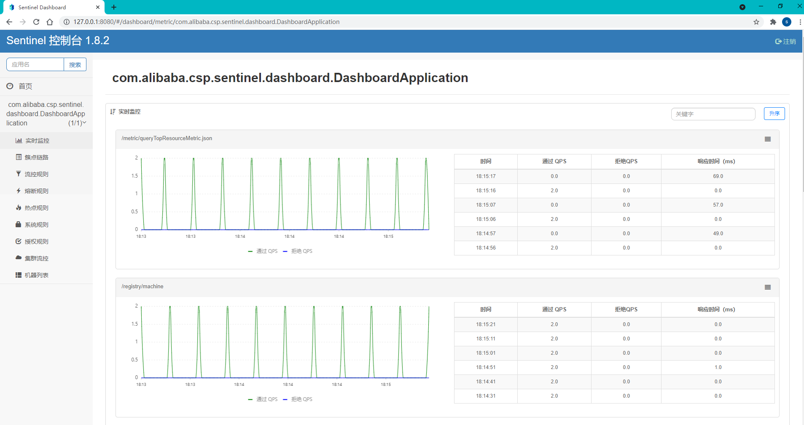


3. 进入influxdb监控后台查看数据

   通过对influxdb的查询，可以看到数据已正常记录：

   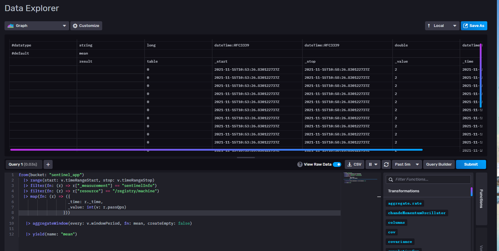


4. 图形化展示

   通过influxdb的dashboard也是可以实现图形化的监控

   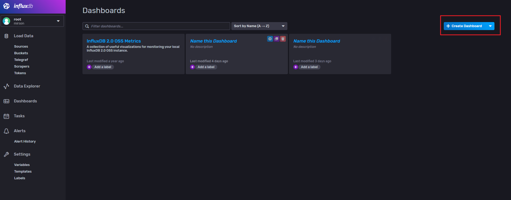

   再做具体的监控配置：

   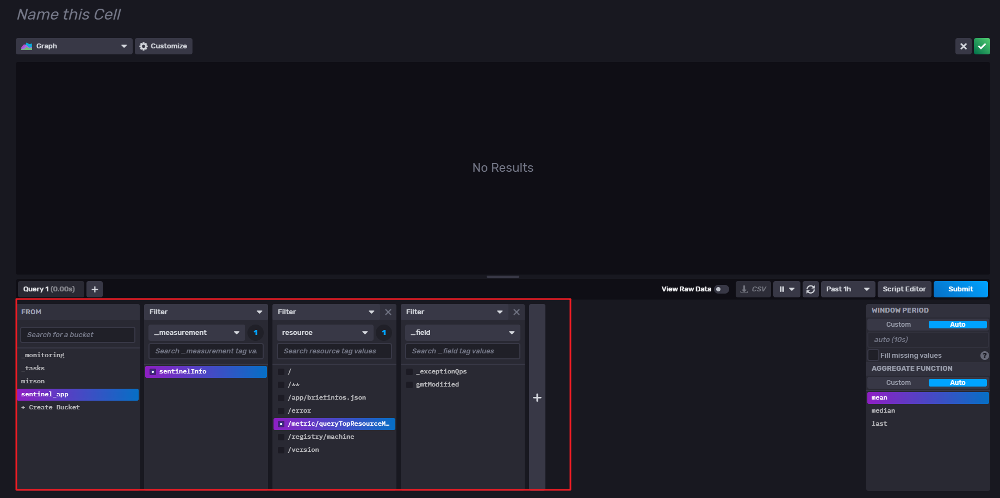

   图形化展示：

   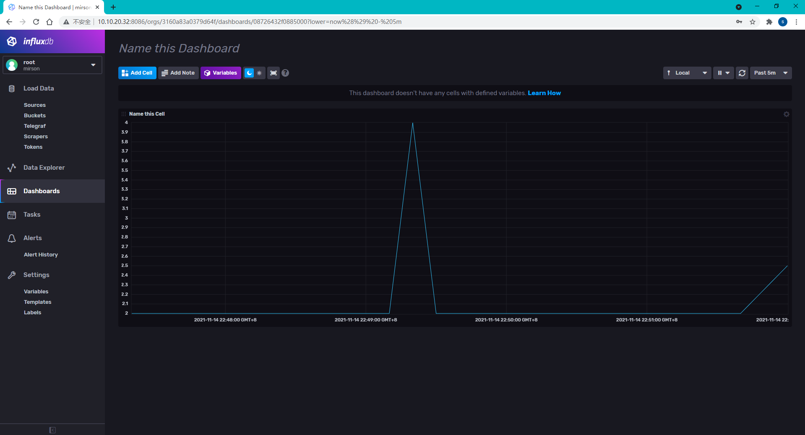

   有了influxdb的数据， 我们也可以接入各种监控系统， 比如grafana,  这里就不再赘述。